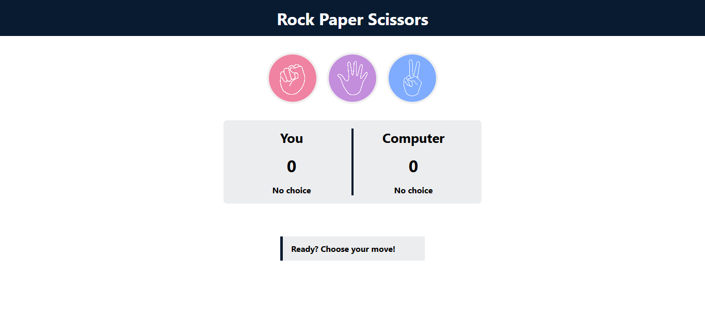

# 🎮 Rock Paper Scissors

A simple and interactive **Rock Paper Scissors** game built using **pure HTML, CSS, and JavaScript**. This project demonstrates DOM manipulation, event handling, game logic, and responsive web design without relying on any external libraries or frameworks.

## 🌐 Live Demo

**Play the game:**  
https://shehramriaz.github.io/rock-paper-scissors/

## 📸 Preview



## ✨ Features

- 🎮 Classic Rock Paper Scissors gameplay
- 🤖 Random computer moves
- 📊 Live score tracking
- 👆 Displays both player and computer choices
- 💬 Dynamic game result messages
- 📱 Responsive design
- ♿ Semantic HTML and accessibility-friendly structure
- 🚀 Built using only HTML, CSS, and JavaScript

## 🛠️ Technologies Used

- HTML5
- CSS3
- JavaScript (ES6)

## 📁 Project Structure

```text
rock-paper-scissors/
├── css/
│   ├── style.css
│   └── media.css
├── js/
│   └── script.js
├── images/
│   ├── icon.png
│   ├── paper.png
│   ├── rock.png
│   ├── scissors.png
│   └── preview.png
├── index.html
├── .gitignore
└── README.md
```

## 🚀 Getting Started

1. Clone the repository.

```bash
git clone https://github.com/shehramriaz/rock-paper-scissors.git
```

2. Open the project folder.

```bash
cd rock-paper-scissors
```

3. Open `index.html` in your browser.

No installation or dependencies are required.

## 🎯 What I Practiced

- Semantic HTML5
- CSS Flexbox
- Responsive Web Design
- DOM Manipulation
- Event Handling
- JavaScript Functions
- Conditional Logic
- Random Number Generation
- Data Attributes
- Accessibility Best Practices

## 📌 Future Improvements

- Game sound effects
- Dark mode
- Win streak tracking
- Game animations
- Difficulty levels
- Keyboard controls

## 🤝 Contributing

Contributions, suggestions, and feedback are welcome. Feel free to open an issue or submit a pull request.

---

Made with ❤️ by **Shehram Riaz**